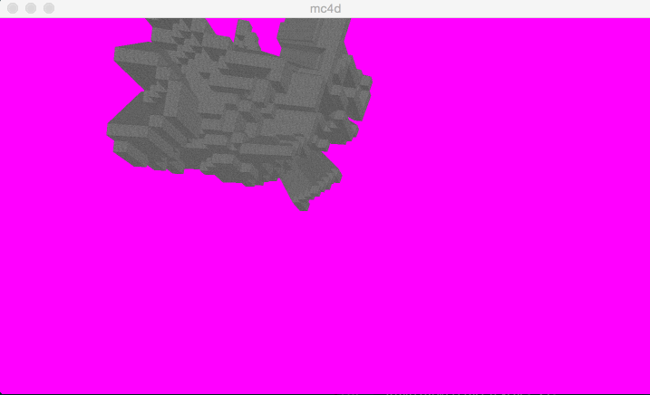

# mc4d #

## Controls ##
    == Basic Controls ==
    ESC   => Exit mc4d

    == Controling the display ==
    ;     => Toggle between displaying round-world and minecraft-world
    ,     => Toggle display of example hypercube wireframe
    .     => Toggle display of hypervoxel world
    + / - => Zoom in/out

    == Rotating the scene ==
    Q / A => Rotate scene in the XY plane
    Z     => Autorotate scene in the XY plane
    W / S => Rotate scene in the XZ plane
    X     => Autorotate scene in the XZ plane
    E / D => Rotate scene in the XW plane
    C     => Autorotate scene in the XW plane
    R / F => Rotate scene in the YZ plane
    V     => Autorotate scene in the YZ plane
    T / G => Rotate scene in the YW plane
    B     => Autorotate scene in the YW plane
    Y / H => Rotate scene in the ZW plane
    N     => Autorotate scene in the ZW plane

    == Rotating the 3d projection ==
    UP/DOWN/LEFT/RIGHT => Rotate 3d projection

## Building ##
Run `make` to build the `mc4d` executable.

Unfortunately, right now the dependencies are a bit messed up, meaning that if you
change a file in the project, you will need to `make clean` before you `make` again.

You can also `make run` if you want to build the project and run it in one fell swoop.

I haven't had a chance to test this project on an platforms other than on my computer,
which is a MacBook Pro running Mac OS X 10.10.2 Yosemite. You will definitely need
the libraraies list in the Library section below.

I will try to get it working on the caslab machines ASAP. Once I do, the repository on
[GitHub](https://github.com/mystor/mc4d) will be updated with a new version.

## Concept ##
The idea behind mc4d was to experiment with what it would be like to render a minecraft-like world, but in 4d. The idea was that players would be able to explore a 4d world and come to understand 4d objects better because It would take a familiar concept (minecraft), and then reveal how it could be expanded into the 4th dimension.

The final end product acts as a viewer for 4d hyper-voxel volumes, textured in a way similar to Minecraft.

## Execution ##
The problem of how to render these 3d objects took quite a while to resolve. The original idea was to represent the world as a 4d array of tiles. Each tile would be either filled (with a block type), or empty, and a ray-tracer would traverse through these textures on the GPU, and when it intersected with a block, it would lookup the color of that block. As this vector math translated very easily to 4d space, it would mean that I could use fairly simple math, but get cool 4d effects fairly easily.

Unfortunately, the number of texture accesses per pixel which were required in order to get this to work was too high. With my text 3d volume, the program was running at only about 30fps, and with an emulated 4d texture, the workload would increase by double per texture lookup. I also experimented with using distance fields to render the scene instead, but ran into resolution problems.

--- IMAGE OF RAYTRACER HERE ---

As I was having severe performance problems with the raytracer, I switched to using standard 3d rendering techniques with faces. I generated the vertices for each of the 24 faces on a tesseract (the faces of the 8 bounding cubes, minus the shared faces). I then used the projection math from [Steve Hollasch's 1991 Master's Thesis](http://steve.hollasch.net/thesis/index.html), which is an extension of the standard 3d projection math into 4d space.

To render using this technique on the GPU, I send the vertex locations of the faces to the GPU as vec4s. The shared matrix and factors are also computed on the CPU and then sent as a uniform. The matrix multiplication is then done on the GPU, and the resulting 3d points are projected using a matrix from `glm::perspective` to screen volume coordinates. The code for the projection can be found in `project.h`, `project.cpp`, `vert.glsl`, and `wirevert.glsl`.

By using that basic strategy, I was able to render a small 4d scene rotating in 4d space. This basic rendering strategy is what is used in the final product, with a few changes.

The world which is being displayed was dynamically generated using 4d simplex noise. To get simplex noise working to render a nice world, I ported the java code from [this paper](http://webstaff.itn.liu.se/~stegu/simplexnoise/simplexnoise.pdf) to c++. The code for this can be found in `noise.h` and `noise.cpp` For simplicity, and because of the small world sizes I am generating, only one frequency of simplex noise is used to create the world. The world generation code for the minecraft-like terrain can be found in `world.h` and `world.cpp`.

One of the goals for the project was to not have external resources, and to generate everything programmatically. The texture for stone is generated using `rand()`, with a fixed seed set with `srand(int)`. The fixed seed allowed for me to find a salt-and-pepper noise value which looked good, without any serious clumps of high or low values, creating a nice texture for the blocks. The texture resolution was chosen to be 16x16 to match with Minecraft's style, and `GL_NEAREST` was chosen as the blending for the same reason.

Next, I changed the way the rendering system worked. Originally, I used pre-built VAOs containing all of the vertices for all of the hypercubes in the terrain. I changed the system to instead use a 1d texture to store the hypercube locations, and `glDrawArraysInstanced()` to draw them. Each voxel would use it's Instance_ID to look up it's location the the texture. Unfortunately, this limited the number of possible voxels to the size of a 1d texture, which on my machine is 16384.

To get around this, and to improve the visuals of the scene. I added multiple block types. Each of these block types has its own texture, which allows each block type to have up to 16384 blocks. I started with just adding grass (which grows on the top of stone blocks), but have since extended it to support sand and water as well.

Unfortunately, as you can see above, I discovered that when the camera gets into certain positions on the screen, the projection freaks out and draws random polygons across the screen. After many hours of trying to figure out why and fix the problem, I decided to change the control scheme to instead allow for the viewing of the 4d volume externally, and allow rotation of the world in 4d space using keybindings.

Unfortunately, when rotating the minecraft-style world, there were a lot of times when the world looked boring, as you were looking at the flat stone bottom of the world. To avoid that, I created another, round world.

At one point, I also tried adding clouds around the round world. They have been taken out and aren't present in the final version though, as I thought that they looked bad.

I also added many more rendering features to make the environment nicer to look at. I made water transparent (which required using a multipass rendering setup using intermediate textures and a blending step). Added basic diffuse phong shading to blocks (which required computing the normals of the faces using a geometry shader). And made the water reflect a skybox. The images for the skybox were taken from [this resource pack on the unity asset store](https://www.assetstore.unity3d.com/en/#!/content/3392).

## Code Credit ##

Not all of the code in this project is 100% mine. This section acts as a place for me to credit the resources which I used to create mc4d.

    GLFW starter code:
      Used to set up the event loop and an OpenGl 4.1 context.
      http://www.glfw.org/docs/latest/quick.html#quick_example

    4d cross product and 4d to 3d projection math:
      Used for rendering all 4d hypervolumes in the program.
      http://steve.hollasch.net/thesis/chapter4.html

    4d simplex noise:
      Code ported to c++ by me. Used for terrain generation.
      http://webstaff.itn.liu.se/~stegu/simplexnoise/simplexnoise.pdf

    Framebuffer creation and use:
      Used to enable smooth transparent rendering of the water volumes.
      Sample code which was used to get my code working nicely.
      https://www.opengl.org/wiki/Framebuffer_Object_Examples#Color_texture.2C_Depth_texture

    Skybox Textures:
      Used to give an awesome environment for the reflective water to show off.
      https://www.assetstore.unity3d.com/en/#!/content/3392

    PNG Reading Code:
      Used to read in the skybox texture data using libpng. Adapted from:
      https://en.wikibooks.org/wiki/OpenGL_Programming/Intermediate/Textures

    4D-Bresenham Line Drawing Algorithm:
      Algorithm not used in final product, but used in raytracer.
      https://sites.google.com/site/proyectosroboticos/bresenham-6d

    GPU Program Management Code:
      Adapted from code provided for assignment 1.

    Help from Ben Cecchetto:
      My CISC 454 professor. Without whom this project could never have happened.

## Libraries ##
This project makes use of the following libraries:

* libpng: PNG reading and parsing
* GLFW: Cross platform OpenGl context creation and input controls
* GLEW: Function declarations & handling of OpenGL extensions
* glm: Matrix and Vector math library used throughout the project

## Code Organization ##
The code in this project looks just awful. `main.cpp` is a massive mess, and many files
simply don't have the TLC which I would like to give to them. Unfortunately, I don't yet
have enough time to refactor the code and clean it up. At some point I may do that, in
which case, the cleaner, easier to read, code will be located on [GitHub](https://github.com/mystor/mc4d).
